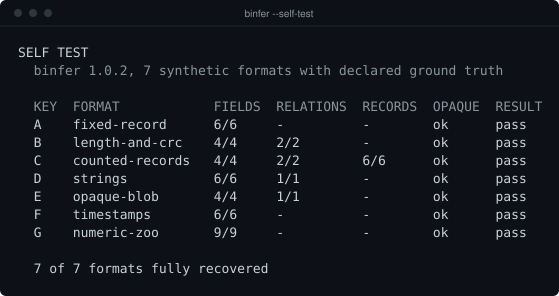
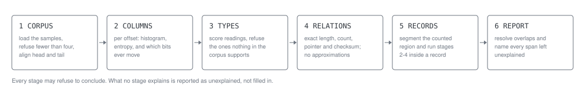

[](https://github.com/joyboyisalive07-lab/binfer/actions/workflows/ci.yml)
[](LICENSE)

English | [Русский](README.ru.md)

binfer reads a directory of sample files in the same unknown binary format and
prints a text report describing the fields it found, with the evidence for each
one.

## Quick start

1. Download `binfer.exe` from the
   [latest release](https://github.com/joyboyisalive07-lab/binfer/releases/latest).
   SmartScreen will warn about it; see [below](#a-note-on-windows-defender-and-smartscreen).
2. **Double-click it.** It offers three things and waits for you before closing:
   - `1` runs the self test on formats whose answers are known, using no files
     of yours. This is the fastest way to see it work.
   - `3` writes two dozen example files to a folder you name and analyses them,
     so you have something to look at if you have no samples yet.
   - `2` analyses a folder of your own.
3. To analyse your own files, put at least four samples of the same unknown
   format in one folder and either type its path into that prompt, drag the
   folder onto `binfer.exe`, or run:

```powershell
.\binfer.exe C:\path\to\samples
```

binfer is a command-line tool, so it prints a report and exits. It writes
nothing anywhere unless you pass `--json` or `--ksy`.

Not on Windows? There is a Linux binary in the same release, and on macOS,
Android or anything else with Python, one pip command gets you the same tool.
See [Install](#install).

## The problem

You have thirty save files from a game, or thirty exports from a program whose
format nobody documented. Opening one in a hex editor tells you almost nothing:
every byte could be anything. Opening thirty and comparing them tells you a
great deal, because the bytes that never change are structure and the bytes that
change together are a field. Doing that comparison by hand is tedious and
error-prone, and it is exactly what a program should do.

binfer does the comparison and then, crucially, refuses to guess. Four uniformly
random bytes decode perfectly well as a 32-bit integer; nothing in the bytes says
otherwise. So a reading is reported only when the corpus carries positive
evidence for it, and every claim arrives with the count that supports it.

## A real report

This is the actual output of `binfer samples/`, on a corpus of twenty-four files
in a format with a length prefix and a trailing CRC32:

```
CORPUS
  24 files analysed
  145..522 bytes, mean 314, median 322
  sizes are not uniform, 24 distinct sizes

LAYOUT
  OFFSET    SIZE  TYPE             VALUE/RANGE       CONFIDENCE EVIDENCE
  EOF-4        4  u32le            see checksum      proved     matches in 24/24
  0x0000       4  magic[4]         'BLOB'            high       identical in 24/24
  0x0004       4  const[4]         01 00 00 00       high       identical in 24/24
  0x0008       4  u32le / u16le    125..502          high       top 2 byte(s) zero in 24/24
  0x000C       4  u32le            547680..16515876  high       top 1 byte(s) zero in 24/24

RELATIONS
  EOF-4 u32le    checksum crc32 over the bytes before it       proved     matches in 24/24
  0x0008 u32le   length   value + 20 == size                   proved     holds exactly in 24/24

REGIONS
  0x0010..EOF-4      unexplained   4.21 bits/byte  nothing found accounts for these bytes

NOTES
  - sizes differ, so offsets were compared over a 72-byte head window and a 72-byte tail window; the
    span between them has no common offset and was measured but not aligned
```

The payload between the header and the checksum is not structure binfer failed
to find. It is a variable-length blob with no structure to find, and the report
says so rather than filling the table with plausible-looking rows.

## Install

| You are on | Take |
| --- | --- |
| Windows | `binfer.exe` from the [latest release](https://github.com/joyboyisalive07-lab/binfer/releases/latest) |
| Linux | `binfer-linux-x86_64` from the same release, then `chmod +x` |
| macOS, or anything with Python | the wheel, or install straight from a tag |
| Android | Python under [Termux](https://termux.dev), then the wheel |

The executables are single files with no installer and no runtime dependencies.
They run from any folder, including a flash drive.

Everywhere else, install with pip. This needs Python 3.12 or newer and works on
any processor and operating system Python runs on:

```bash
python -m pip install https://github.com/joyboyisalive07-lab/binfer/archive/refs/tags/v1.0.5.tar.gz
binfer --self-test
```

On Android, the same command works inside Termux:

```bash
pkg install python
python -m pip install https://github.com/joyboyisalive07-lab/binfer/archive/refs/tags/v1.0.5.tar.gz
python -m binfer --self-test
```

There is no phone build and there will not be one. An executable is compiled for
one processor and one operating system, and Android and iOS run neither the
Windows nor the Linux binary. The Python package is the portable form, and it is
the same code.

To work on it instead of just using it:

```bash
git clone https://github.com/joyboyisalive07-lab/binfer
cd binfer
python -m pip install -e ".[dev]"
```

### A note on Windows Defender and SmartScreen

SmartScreen will warn about `binfer.exe`, and Defender occasionally quarantines
it. Two things cause it, and only one of them is fixable at all.

A PyInstaller one-file executable unpacks a Python interpreter into a temporary
directory and runs it. Some heuristics treat that shape as suspicious no matter
who built it.

The binary is also unsigned. **A code-signing certificate is the only thing that
removes the warning**, and there is no free one: a certificate from a
certificate authority costs a few hundred dollars a year, and a self-signed
certificate makes matters worse, because Windows then reports an untrusted
publisher rather than an unknown one. Free signing does exist for open-source
projects through [SignPath](https://about.signpath.io/product/open-source) and
cheaply through Azure Trusted Signing, but both want an established project with
a history, so neither is available to this one yet.

Until then:

- **Verify what you downloaded.** Every release ships a `.sha256` beside each
  binary. Compare with `Get-FileHash .\binfer.exe -Algorithm SHA256`. The
  binaries are built by the release workflow from the tagged commit and the
  build log is public, so you can check that the file you hold came from the
  source you can read.
- **To run it anyway:** click **More info** in the SmartScreen dialog, then
  **Run anyway**.
- **Or avoid the question entirely** and install with pip, as above. Nothing
  warns about that, and it is the same code.

### Running it

Three ways, all equivalent:

- **Double-click it.** With no arguments it asks whether to run the self test or
  to analyse a folder, and waits for you before closing the window.
- **Drag a folder of samples onto `binfer.exe`.** That is the same as passing
  the folder on the command line.
- **From PowerShell**, which is what you want for the options:

```powershell
.\binfer.exe --self-test
.\binfer.exe C:\path\to\samples --json findings.json
```

## Usage

```
binfer <directory>                 analyse a corpus and print the report
binfer <directory> --json FILE     also write machine-readable findings
binfer <directory> --ksy FILE      also write a Kaitai Struct draft
binfer --self-test                 grade the tool against known ground truth
binfer --version
binfer --help
```

Flags: `--min-confidence {low,high,proved}`, `--max-files N`, `--record-size N`,
`--no-color`.

Exit codes are 0 for success, 1 when the analysis could not run or the self test
found a regression, and 2 for a usage error.

Point it at a directory of at least four files; twelve or more makes the
statistics worth trusting, and the report says so when there are fewer.

```bash
binfer ./saves --json findings.json --ksy saves.ksy
```

`--self-test` needs no files of your own. It builds seven synthetic formats in
memory, each with a schema written down before the bytes existed, runs the full
analysis over them and grades the result:



## How the analysis works



Each stage may decline to conclude anything. What no stage explains is reported
as unexplained, and that is a result, not a failure.

## Confidence tiers

There are exactly three, and they mean specific things.

| Tier | Meaning |
| --- | --- |
| `proved` | Holds in 100% of samples and is falsifiable. Checksums and length arithmetic: a single mismatching sample would kill the finding outright. |
| `high` | Holds in 100% of samples but rests on a statistical argument. Type guesses live here: `u32le` is the best reading of those four bytes, not a provable fact about them. |
| `low` | Holds in most samples but not all, reported so you can judge it. A string field that decodes cleanly in 20 files out of 22 is worth seeing. |

`--min-confidence` hides the tiers below the one you ask for, in the field table
and in the nested record table alike.

## What v1.0 deliberately does not do

- **It does not guess a record size.** Segmentation follows a count field whose
  arithmetic was proved exactly, or the `--record-size` you supply. A blind
  search over plausible strides is a real technique, but none of the synthetic
  formats here would demonstrate that it works, so it is not shipped.
- **It does not decompress anything.** A compressed or encrypted span is
  reported as high-entropy and unexplained. That is the answer, not a gap to be
  filled later.
- **It does not follow pointers into nested structures.** A pointer that lands
  on a string is reported as a pointer; what the string means is your problem.
- **It does not parse a single file.** Everything rests on comparing samples, so
  a corpus of one tells it nothing and it will say so.
- **It never writes anywhere you did not name.** No cache, no temporary corpus,
  no config file. `--self-test` builds its samples in memory.

## Building from source

```powershell
python -m pip install -e ".[dev]"
python -m pytest
python -m ruff check .
python tools/coverage.py
pwsh tools/build.ps1
```

`tools/build.ps1` produces `dist/binfer.exe` and refuses to call the build done
until that executable has run `--self-test` and recovered the ground truth of
every synthetic format. A binary that starts and prints a version number has
proved nothing.

`tools/gen_corpus.py` writes the synthetic corpora to disk if you want to open
them in a hex editor. `tools/make_images.py` regenerates the images above; the
self-test picture is typeset from output the tool actually produced.

## License

MIT, see [LICENSE](LICENSE).
